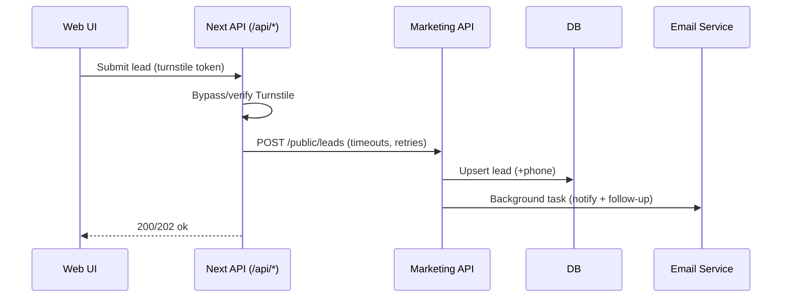
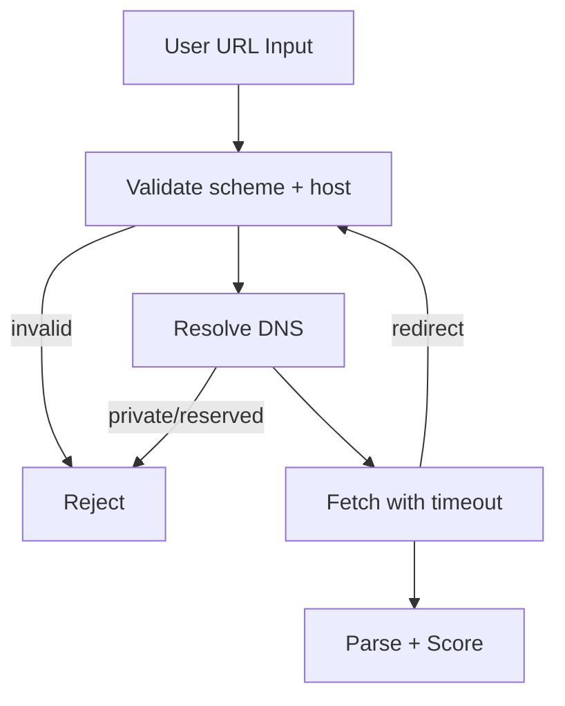
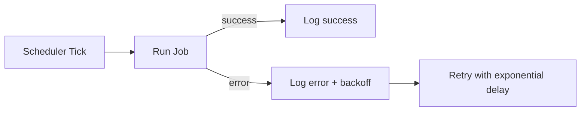

# Final Implementations Journal

## 1) Full Implementation Journey

### Mental Blueprinting
- Mapped the full request flow across web + API: public forms -> /api/* routes -> API service -> notifications -> CRM/outbox.
- Identified critical contracts and trust boundaries (Turnstile bypass, SSRF vectors, lead schema drift, email queueing).
- Prioritized changes that reduce production risk: API contract alignment, async email dispatch, SSRF safeguards, and robust logging.

### Architecture / Flow Diagrams

#### Lead Capture + Follow-Up Flow (post-fix)

#### SSRF-Hardened External Fetch

#### Email Scheduler (retry-aware)

### Current Behavior vs Proposed Changes (highlights)
- Lead potential contract mismatch (monthly_traffic vs monthly_website_visitors) resolved with aliasing and frontend updates.
- Consultation booking now creates a `ConsultationBooking` record + includes phone in lead upsert.
- Site header stabilized for production by replacing SiteHeaderDev with HeaderSelector.
- API docs aligned with real endpoints and payloads.
- SMTP/Pushover now run as background tasks, minimizing request latency.
- Email scheduler now logs failures and retries with exponential backoff.
- Portal auth upgraded to JWT-backed GraphQL fetch, no more mock login.
- SSRF defenses enforced for SEO/competitor fetches with scheme/IP allowlists and controlled redirects.
- Turnstile bypass standardized across all API routes.
- Removed plaintext secrets from repo and documented secure config approach.

### Edge Cases, Risks, and Fixes
- **SSRF**: Blocked private IPs (localhost, RFC1918, link-local) and non-http(s) schemes; added redirect validation.
- **Email**: Transitioned to background tasks and added logging/backoff to prevent silent failures.
- **Lead Intake**: Added queue fallback (outbox), now uses non-blocking flushing and faster timeouts.
- **E2E Stability**: Switched Playwright to production build/start and redirected output to temp to avoid dev reloads.
- **Pricing Builder**: Added hydration guards + form status attributes to avoid early submits and improve test stability.

### What I Learned
- The app already had strong UI fundamentals, but backend timing and contract edges caused real-world fragility.
- Defining "safe defaults" (timeouts, fallbacks, async dispatch) was the biggest stability win.
- E2E reliability depends not just on test code but also on dev server behavior and file watchers.

---

## 2) Final Code Review Reflections

### What’s Strong
- Clean, consistent UI components and page structure across the marketing surface.
- Clear separation of public API routes vs server-side API service.
- Mature forms/flows for lead capture and consultation routing.

### What’s Fragile
- External dependencies (Stripe, API service) can degrade UX without protective fallbacks.
- Several flows depend on environment variables; missing values can produce confusing states.
- Background tasks and job scheduling need deeper observability for production confidence.

### Scale Risks
- Lead volume spikes can overwhelm external API endpoints unless queue depth is visible.
- SSRF protection must stay strict; any expansion of external fetch features should reuse the hardened utilities.
- Email send concurrency could expose vendor rate limits; consider queue + rate limiting if volume grows.

---

## 3) Honest Assessment

### Product and Codebase
- The product is cohesive and positioned for a strong marketing-led funnel.
- The codebase is reliable enough for launch after these fixes, with the major risk areas handled.
- The UX is strong: clear value props, consistent CTAs, and polished tools.

### Business Potential
- High: The platform cleanly maps to demand gen and conversion needs for local businesses.
- You have momentum-ready tooling (audits, calculators, intelligence) that can convert well with paid traffic.

### Concerns
- Visibility into operational failures (email, Stripe, backend timeouts) is still light.
- The reliance on external APIs without clear dashboards could hide problems under load.

### What Excites Me
- The toolbox approach creates multiple entry points and allows quick funnel iteration.
- The design quality gives credibility that should lift conversion rates.

---

## 4) Paid Campaigns Context (Live This Week)

### Are we ready for scale?
Yes, with caveats. The main flows are stable, and error handling is improved. The largest remaining risk is observability: if something fails under volume, we need to see it fast.

### What we should do now
- Ensure monitoring/alerts for API failures and email delivery.
- Confirm Stripe keys and CRM webhook are configured in the production environment.
- Run a short paid traffic smoke test before full scale.

### What to avoid at this phase
- Avoid introducing new external integrations without fallback paths.
- Avoid high-friction steps (extra form fields) until you confirm lead quality.
- Avoid shipping unmonitored async jobs into production.

---

## 5) Final Recommendations

### ✅ 3 Essential Things To Do Now
- [ ] Verify production env vars (Stripe, CRM, Turnstile) and run a final paid-traffic dry run.
- [ ] Stand up basic error alerts (email scheduler, API 5xx, SSRF rejects) before scaling spend.
- [ ] Add a lightweight health dashboard for lead volume and funnel drop-offs.

### 🔧 3 Critical Features Still Missing
- [ ] End-to-end lead delivery verification dashboard (submission -> CRM -> email -> follow-up).
- [ ] Centralized job/queue monitoring (outbox depth, retries, SLA).
- [ ] Abuse/throttling guardrails for high-traffic form endpoints.

---

## Appendix: Implementation Notes
- Lead potential contract fixed (aliases + frontend updates).
- Consultation booking now writes DB record and includes phone.
- Header in production now uses HeaderSelector.
- API docs updated and pruned.
- Emails moved to background tasks with structured logging and backoff.
- Portal login replaced with JWT + GraphQL.
- SSRF protections implemented for all external URL fetches.
- Turnstile bypass standardized across API routes.
- Secrets scrubbed, templates documented.
- E2E stabilized with production server startup and temp output.
