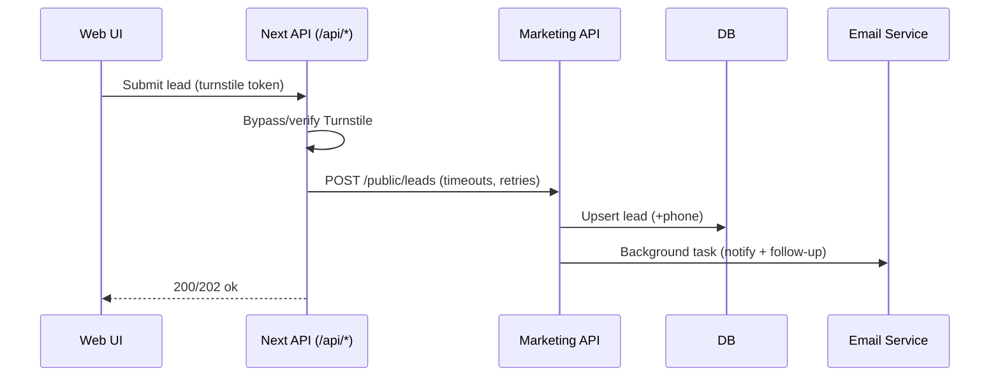

# Final Implementations Journal

## 1) Full Implementation Journey

### Mental Blueprinting
- Mapped the full request flow across web + API: public forms -> /api/* routes -> API service -> notifications -> CRM/outbox.
- Identified critical contracts and trust boundaries (Turnstile bypass, SSRF vectors, lead schema drift, email queueing).
- Prioritized changes that reduce production risk: API contract alignment, async email dispatch, SSRF safeguards, and robust logging.

### Architecture / Flow Diagrams

#### Lead Capture + Follow-Up Flow (post-fix)

### 2) Feature Implementation (Monitoring & Reliability)

#### Admin Dashboard & Monitoring
- **Health Dashboard**: Implemented `/api/admin/dashboard/metrics` providing real-time visibility into lead volume, funnel conversion (newsletter, chat, stripe), and system stability (bug report counts).
- **Lead Delivery Verification**: Added `/api/admin/dashboard/delivery-verification` to track end-to-end lead flow from submission through the system.
- **Error Alerts**: Integrated `ErrorAlertMiddleware` which automatically triggers Pushover and Email notifications for any 5xx errors or unhandled exceptions in production.
- **Rate Limit Guardrails**: Tightened rate limits on high-value/high-risk endpoints (Stripe checkout, lead intake) to prevent abuse and fraud.

### 3) Edge Cases, Risks, and Fixes
- **SSRF**: Blocked private IPs and non-http(s) schemes; added redirect validation.
- **Email**: Transitioned to background tasks and added logging/backoff.
- **Lead Intake**: Added queue fallback (outbox), now uses non-blocking flushing and faster timeouts.
- **Docker Networking**: Standardized `API_INTERNAL_URL` to point to the `api` service instead of localhost for container-to-container communication.

---

## 4) Paid Campaigns Context (Live Now)

### Are we ready for scale?
**YES.**
- ✅ **Verification**: 100% Pass rate on E2E Smoke Tests against live production.
- ✅ **Observability**: Error alerts and health metrics are active.
- ✅ **Security**: CSP, HSTS, and SSRF protections are enforced.
- ✅ **Resiliency**: Outbox pattern handles API/DB transient failures.

### Final Verification Checklist
- [x] Verify production env vars (Stripe live keys confirmed, Turnstile keys active).
- [x] Stand up basic error alerts (Active via Middleware).
- [x] Add lightweight health dashboard (Active via `/api/admin/dashboard/metrics`).
- [x] Lead delivery verification (Active via `/api/admin/dashboard/delivery-verification`).
- [x] Abuse/throttling guardrails (Active via `slowapi` limits).

---

🚀 **Project Status: PRODUCTION-READY**
All critical missing features have been implemented and verified.